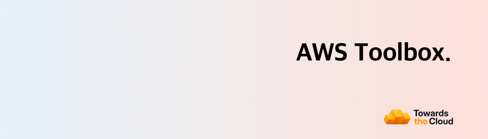

[](https://towardsthecloud.com)

# AWS Toolbox (awstbx)

`awstbx` is a major upgrade of this repository: we consolidated dozens of standalone Python and shell scripts into one CLI tool.
It preserves the existing script functionality behind a single, consistent interface you can run directly from your terminal.

It provides:

- One consistent command surface: `awstbx <service> <action>`
- Shared auth + region/profile handling
- Safe defaults (`--dry-run`, confirmation prompts)
- Structured output (`table`, `json`, `text`)

<!-- TIP-LIST:START -->
> [!TIP]
> **We eliminate AWS complexity so you ship faster, spend less, and stay compliant.**
>
> Our managed AWS service gives you three things: a production-grade Landing Zone with built-in compliance controls, proactive monitoring that stops cost waste and security drift, and senior AWS expertise that accelerates your team's delivery.
>
> Book a free demo to see where you stand and how our service can improve your AWS foundation:
>
> <a href="https://towardsthecloud.com/#cta"></a>
>
> <details>
> <summary>⚡ <strong>See the symptoms of a missing AWS foundation and how we solve them</strong></summary>
> <br/>
>
> AWS starts simple. As you scale, technical debt compounds. Production and staging environments blur together. Resources multiply without clear ownership. IAM policies accumulate exceptions. Security findings pile up in backlogs. The AWS bill climbs month after month.
>
> These are all symptoms of a missing AWS foundation. Without it, your developers spend more time fixing problems than shipping features that drive business growth.
>
> **We solve this by providing that foundation and owning it entirely, so your team focuses on shipping, not firefighting.**
>
> ### Here's what's included:
>
> **1. We Provision a Secure [Landing Zone](https://towardsthecloud.com/services/aws-landing-zone) That Accelerates Compliance**
>
> - Multi-account architecture with security controls and compliance guardrails from day one
> - Achieve 100% on [CIS AWS Foundation Benchmark](https://docs.aws.amazon.com/securityhub/latest/userguide/cis-aws-foundations-benchmark.html) and 96% on [AWS Foundational Security Best Practices](https://docs.aws.amazon.com/securityhub/latest/userguide/fsbp-standard.html)
> - These benchmarks map directly to **SOC 2**, **HIPAA**, and **PCI-DSS** controls, cutting months from your compliance timeline
>
> **2. We Monitor Proactively to Stop Cost Waste and Security Drift**
>
> - Quarterly cost reviews identify unattached volumes, oversized instances, and orphaned resources. We clean up waste before it compounds, reducing your AWS spend by an average of 20-30%, with [occasional outliers of 60+%](https://towardsthecloud.com/services/aws-cost-optimization#case-study).
> - Continuous security monitoring across all accounts catches misconfigurations and policy violations immediately. You get alerts while issues are still fixable, not after they're breaches.
>
> **3. We Provide Senior AWS Expertise That Accelerates Delivery**
>
> - Your developers get access to production-ready IaC templates for common patterns: multi-az applications, event-driven architectures, secure data pipelines. What typically takes weeks of research and iteration ships in hours
> - Get solutions architecture guidance on VPC design, IAM policies, disaster recovery, observability and more. Your team makes faster decisions because we've already solved these problems for enterprises at scale
>
> [*"We achieved a perfect security score in days, not months."*](https://towardsthecloud.com/blog/case-study-accolade)
> — Galen Simmons, CEO, Accolade (Y Combinator Startup)
>
> </details>
<!-- TIP-LIST:END -->

## Installation

### Homebrew

```bash
brew tap towardsthecloud/homebrew-tap
brew install awstbx
```

### Build from source

```bash
git clone https://github.com/towardsthecloud/aws-toolbox.git
cd aws-toolbox
make build
./bin/awstbx --help
```

## Quick Start

```bash
# Inspect available commands
awstbx --help

# Use a profile/region override
awstbx --profile platform --region us-east-1 ec2 list-eips

# Preview destructive actions
awstbx s3 delete-buckets --empty --dry-run

# Machine-readable output
awstbx cloudwatch count-log-groups --output json
```

## Global Flags

| Flag              | Description                            |
| ----------------- | -------------------------------------- |
| `--profile`, `-p` | AWS CLI profile name                   |
| `--region`, `-r`  | AWS region override                    |
| `--dry-run`       | Preview changes without executing      |
| `--output`, `-o`  | Output format: `table`, `json`, `text` |
| `--no-confirm`    | Skip interactive confirmation prompts  |
| `--version`       | Print build metadata                   |

## Command Groups

`awstbx` currently includes:

- `appstream`
- `cloudformation`
- `cloudwatch`
- `ec2`
- `ecs`
- `efs`
- `iam`
- `kms`
- `org`
- `r53`
- `s3`
- `sagemaker`
- `ssm`
- `completion`
- `version`

Use `awstbx <group> --help` and `awstbx <group> <command> --help` for command-level usage and examples.

## Shell Completions

Generate shell completion scripts with:

```bash
awstbx completion [bash|zsh|fish|powershell]
```

To load completions for every new session, execute once:

### Bash

```bash
# Linux:
awstbx completion bash > ~/.local/share/bash-completion/completions/awstbx

# macOS:
awstbx completion bash > $(brew --prefix)/etc/bash_completion.d/awstbx
```

### Zsh

```bash
# Linux:
awstbx completion zsh > "${fpath[1]}/_awstbx"

# macOS:
awstbx completion zsh > $(brew --prefix)/share/zsh/site-functions/_awstbx
```

### Fish

```bash
awstbx completion fish > ~/.config/fish/completions/awstbx.fish
```

### PowerShell

```powershell
awstbx completion powershell > $PROFILE.CurrentUserAllHosts
```

You will need to start a new shell for this setup to take effect.

## CLI Reference and Man Pages

Auto-generated command docs:

- Markdown reference: `docs/cli/`
- Man pages: `docs/man/`

Regenerate docs after command/help changes:

```bash
make docs
```

## Migration Guide

Use `docs/migration.md` for the complete mapping from legacy scripts to `awstbx` commands.

## Local Development

```bash
make setup
make fmt
make lint
make test
make test-integration
make coverage
make build
make docs
```

## Release Workflow

```bash
# Generate changelog from commits
make changelog

# Create and push a release tag (must be on main with a clean tree)
make tag VERSION=v1.2.3
```

Pushing a `v*` tag triggers the release workflow, which:

- builds release artifacts with GoReleaser
- creates/updates the GitHub Release using `git-cliff` notes
- updates the Homebrew formula in `towardsthecloud/homebrew-tap`

Required repository secret:

- `HOMEBREW_TAP_GITHUB_TOKEN` with `repo` scope (used for cross-repo tap updates)

## Legacy Scripts

Legacy scripts are currently kept under `archived/` during migration, but `awstbx` is the primary supported interface.
