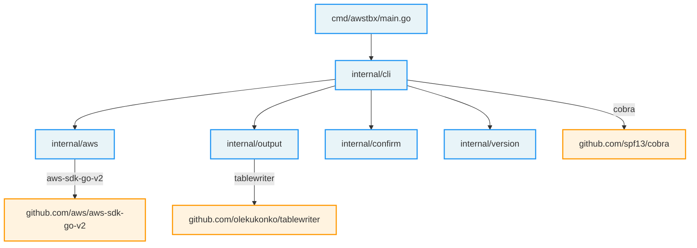
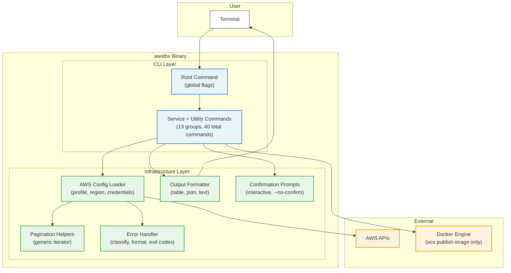

# `awstbx` Architecture Document

## 1. Executive Summary

**awstbx** is a unified Go CLI that replaces the 57 loose Python and Bash scripts in [aws-toolbox](https://github.com/towardsthecloud/aws-toolbox). These scripts automate repetitive AWS tasks — resource cleanup, identity management, infrastructure operations — but have accumulated five different authentication approaches, three argument-parsing generations, five output styles, and zero tests.

The rewrite consolidates them into a single statically-linked binary with a consistent command hierarchy (`awstbx <service> <action>`), unified authentication, structured output, dry-run safety, and full test coverage. The result is a tool that can be installed via `brew install awstbx`, needs no runtime dependencies, and provides the same functionality with a predictable UX.

### Goals

- **Single binary** — no Python, no pip, no virtualenvs
- **Consistent UX** — every command supports `--profile`, `--region`, `--dry-run`, `--output`, `--no-confirm`
- **Shell-native ergonomics** — built-in autocomplete generation for `bash`, `zsh`, `fish`, and `powershell`
- **Safe by default** — destructive operations require confirmation unless `--no-confirm` is set
- **Tested** — unit tests with AWS SDK mocks, integration tests against localstack
- **Distributable** — Homebrew tap, GitHub Releases, goreleaser

### Scope

Of the 58 items in the current repository (49 Python scripts, 8 Bash scripts, 1 CLI alias file):

- **38 commands** are created (some scripts merge into a single command)
- **5 scripts** are dropped (Lambda handlers and fully-hardcoded scripts)
- **4 items** are excluded (out-of-scope for a remote CLI tool)

---

## 2. Current State Analysis

### 2.1 Script Inventory

| #   | Category       | Script                                        | Language   | Auth Pattern            | Arg Parsing        | Output Style    |
| --- | -------------- | --------------------------------------------- | ---------- | ----------------------- | ------------------ | --------------- |
| 1   | AppStream      | `appstream_delete_image.py`                   | Python     | `boto3.client()`        | argparse           | print           |
| 2   | CloudFormation | `cfn_delete_stackset.py`                      | Python     | `boto3.client()`        | argparse           | print           |
| 3   | CloudFormation | `cfn_find_stack_by_resource.py`               | Python     | `boto3.client()`        | argparse           | print           |
| 4   | CloudWatch     | `cw_count_log_groups.py`                      | Python     | `boto3.client()`        | argparse           | print           |
| 5   | CloudWatch     | `cw_delete_log_groups.py`                     | Python     | `boto3.client()`        | argparse           | print           |
| 6   | CloudWatch     | `cw_delete_log_groups_by_name.py`             | Python     | `boto3.client()`        | argparse           | print           |
| 7   | CloudWatch     | `cw_fetch_log_groups_with_creation_date.py`   | Python     | `boto3.client()`        | argparse           | print           |
| 8   | CloudWatch     | `cw_set_retention_policy.py`                  | Python     | `boto3.client()`        | argparse           | print           |
| 9   | CodePipeline   | `cp_slack_notifications.py`                   | Python     | `os.getenv`             | none (Lambda)      | Slack webhook   |
| 10  | EC2            | `ec2_delete_unattached_volumes.py`            | Python     | `boto3.client()`        | argparse           | logging         |
| 11  | EC2            | `ec2_delete_orphaned_snapshots.py`            | Python     | `boto3.client()`        | argparse           | logging         |
| 12  | EC2            | `ec2_delete_old_amis.py`                      | Python     | `setup_default_session` | argparse           | logging         |
| 13  | EC2            | `ec2_delete_ssh_access_security_groups.py`    | Python     | `boto3.client()`        | argparse           | print           |
| 14  | EC2            | `ec2_delete_unused_amis.py`                   | Python     | `boto3.client()`        | argparse           | logging         |
| 15  | EC2            | `ec2_delete_unused_eips.py`                   | Python     | `boto3.client()`        | argparse           | logging         |
| 16  | EC2            | `ec2_delete_unused_keypairs_all_regions.py`   | Python     | `boto3.resource()`      | none (hardcoded)   | print           |
| 17  | EC2            | `ec2_delete_unused_keypairs_single_region.py` | Python     | `boto3.client()`        | argparse           | logging         |
| 18  | EC2            | `ec2_delete_tagged_security_groups.py`        | Python     | `boto3.client()`        | argparse           | print           |
| 19  | EC2            | `ec2_find_unattached_volumes.py`              | Python     | `boto3.client()`        | argparse           | logging         |
| 20  | EC2            | `ec2_asg_ssh.sh`                              | Bash (zsh) | AWS CLI env             | positional args    | echo            |
| 21  | EC2            | `ec2_list_available_eips.sh`                  | Bash (zsh) | AWS CLI env             | none               | echo            |
| 22  | EC2            | `ec2_request_spot_instances.sh`               | Bash       | AWS CLI env             | none (hardcoded)   | echo            |
| 23  | EC2            | `ec2_resize_volume.sh`                        | Bash       | instance metadata       | positional `$1`    | echo            |
| 24  | ECS            | `ecs_delete_inactive_task_definitions.py`     | Python     | `boto3.client()`        | argparse           | logging         |
| 25  | ECS            | `ecs_publish_ecr_image.sh`                    | Bash       | AWS CLI `--profile`     | `getopts`-style    | echo            |
| 26  | EFS            | `efs_delete_tagged_filesystems.py`            | Python     | `boto3.client()`        | argparse           | print           |
| 27  | IAM            | `iam_delete_user.py`                          | Python     | `boto3.client()`        | none (library)     | print           |
| 28  | IAM            | `iam_identity_center_create_users.py`         | Python     | `boto3.client()`        | argparse           | print           |
| 29  | IAM            | `iam_rotate_access_keys.py`                   | Python     | `boto3.client()`        | argparse           | print           |
| 30  | IAM            | `iam_assume_role.sh`                          | Bash (zsh) | STS assume-role         | positional args    | echo            |
| 31  | KMS            | `kms_delete_keys_by_tag.py`                   | Python     | `boto3.client()`        | argparse           | logging         |
| 32  | KMS            | `kms_delete_unused_keys.py`                   | Python     | `boto3.client()`        | argparse           | logging         |
| 33  | Route 53       | `r53_create_health_checks.py`                 | Python     | `boto3.client()`        | `sys.argv`         | print           |
| 34  | Organizations  | `org_assign_sso_access_by_ou.py`              | Python     | `boto3.client()`        | argparse           | print           |
| 35  | Organizations  | `org_generate_mermaid_diagram.py`             | Python     | `boto3.client()`        | none               | stdout + stderr |
| 36  | Organizations  | `org_get_account_details.py`                  | Python     | `boto3.client()`        | argparse           | print           |
| 37  | Organizations  | `org_import_users_to_sso.py`                  | Python     | `boto3.client()`        | argparse           | print           |
| 38  | Organizations  | `org_list_accounts_by_ou.py`                  | Python     | `boto3.client()`        | argparse           | print           |
| 39  | Organizations  | `org_list_sso_assignments.py`                 | Python     | `boto3.client()`        | none               | json.dumps      |
| 40  | Organizations  | `org_remove_sso_access_by_ou.py`              | Python     | `boto3.client()`        | argparse           | print           |
| 41  | S3             | `s3_create_tar.py`                            | Python     | `boto3.client()`        | none (Lambda)      | print           |
| 42  | S3             | `s3_delete_empty_buckets.py`                  | Python     | `boto3.client()`        | argparse           | print           |
| 43  | S3             | `s3_list_old_files.py`                        | Python     | `boto3.client()`        | argparse           | print           |
| 44  | S3             | `s3_search_bucket_and_delete.py`              | Python     | `boto3.client()`        | `sys.argv`         | print           |
| 45  | S3             | `s3_search_bucket_and_download.py`            | Python     | `boto3.client()`        | `sys.argv`         | print           |
| 46  | S3             | `s3_search_file.py`                           | Python     | `boto3.client()`        | none (hardcoded)   | print           |
| 47  | S3             | `s3_search_key.py`                            | Python     | `boto3.client()`        | `sys.argv`         | print           |
| 48  | S3             | `s3_search_multiple_keys.py`                  | Python     | `boto3.client()`        | `sys.argv`         | print           |
| 49  | S3             | `s3_search_subdirectory.py`                   | Python     | `boto3.client()`        | `sys.argv`         | print           |
| 50  | SageMaker      | `sm_cleanup_spaces.py`                        | Python     | `boto3.Session()`       | none (interactive) | print           |
| 51  | SageMaker      | `sm_delete_user_profile.py`                   | Python     | `boto3.client()`        | argparse           | print           |
| 52  | SSM            | `ssm_delete_parameters.sh`                    | Bash (zsh) | AWS CLI env             | positional `$1`    | echo            |
| 53  | SSM            | `ssm_import_parameters.sh`                    | Bash (sh)  | AWS CLI env             | positional `$1`    | echo            |
| 54  | General        | `delete_unused_security_groups.py`            | Python     | `boto3.client()`        | argparse           | logging         |
| 55  | General        | `tag_secrets_manager_secrets.py`              | Python     | `boto3.client()`        | none (Lambda)      | print           |
| 56  | General        | `set-alternate-contact.py`                    | Python     | `boto3.client()`        | argparse           | print           |
| 57  | General        | `multi_account_command_executor.py`           | Python     | STS assume-role         | none (Lambda)      | print           |
| 58  | General        | `cli/alias` (README: `aws_cli_aliases.sh`)    | CLI alias  | N/A                     | N/A                | N/A             |

### 2.2 Pattern Inconsistencies

| Concern               | Variations Found | Examples                                                                                                         |
| --------------------- | ---------------- | ---------------------------------------------------------------------------------------------------------------- |
| **Authentication**    | 5 patterns       | `boto3.client()` direct, `boto3.Session()`, `setup_default_session(profile_name=)`, `os.getenv`, STS assume-role |
| **Argument parsing**  | 5 patterns       | `argparse`, `sys.argv`, positional shell args, hardcoded values, no args (interactive/Lambda)                    |
| **Output formatting** | 5 patterns       | bare `print()`, `logging` module, `json.dumps`, `echo`, stderr/stdout split                                      |
| **Error handling**    | 3 patterns       | `try/except ClientError`, bare `except Exception`, no error handling                                             |
| **Dry-run support**   | 2 patterns       | 18 scripts support `--dry-run`, 30 scripts have no dry-run safety                                                |
| **Testing**           | 0                | No test files exist anywhere in the repository                                                                   |

---

## 3. Architecture Design

### 3.1 Project Structure

```
awstbx/
├── cmd/
│   └── awstbx/
│       └── main.go                 # Entry point
├── internal/
│   ├── cli/
│   │   ├── root.go                 # Root cobra command, global flags
│   │   ├── completion.go           # awstbx completion [bash|zsh|fish|powershell]
│   │   ├── appstream.go            # awstbx appstream ...
│   │   ├── cfn.go                  # awstbx cfn ...
│   │   ├── cloudwatch.go           # awstbx cloudwatch ...
│   │   ├── ec2.go                  # awstbx ec2 ...
│   │   ├── ecs.go                  # awstbx ecs ...
│   │   ├── efs.go                  # awstbx efs ...
│   │   ├── iam.go                  # awstbx iam ...
│   │   ├── kms.go                  # awstbx kms ...
│   │   ├── org.go                  # awstbx org ...
│   │   ├── r53.go                  # awstbx r53 ...
│   │   ├── s3.go                   # awstbx s3 ...
│   │   ├── sagemaker.go            # awstbx sagemaker ...
│   │   └── ssm.go                  # awstbx ssm ...
│   ├── aws/
│   │   ├── config.go               # Shared AWS config loader (profile, region)
│   │   ├── pagination.go           # Generic paginator helpers
│   │   └── errors.go               # AWS error classification & messaging
│   ├── output/
│   │   ├── formatter.go            # Output formatter interface
│   │   ├── table.go                # Table output (default)
│   │   ├── json.go                 # JSON output
│   │   └── text.go                 # Plain text output
│   ├── confirm/
│   │   └── prompt.go               # Interactive confirmation prompts
│   └── version/
│       └── version.go              # Build-time version injection
├── go.mod
├── go.sum
├── .goreleaser.yaml
├── Makefile
└── README.md
```

### 3.2 Shared Infrastructure

#### AWS Configuration (`internal/aws/config.go`)

Every command shares a single AWS configuration loader. Global flags `--profile` and `--region` are resolved once at the root command level and injected into all service clients.

```go
// Pseudocode — actual implementation will use aws-sdk-go-v2/config
func LoadAWSConfig(profile, region string) (aws.Config, error) {
    opts := []func(*config.LoadOptions) error{}
    if profile != "" {
        opts = append(opts, config.WithSharedConfigProfile(profile))
    }
    if region != "" {
        opts = append(opts, config.WithRegion(region))
    }
    return config.LoadDefaultConfig(context.Background(), opts...)
}
```

#### Output Formatting (`internal/output/`)

All commands emit results through a `Formatter` interface. The global `--output` flag selects the implementation:

| Format | Flag                       | Use Case                               |
| ------ | -------------------------- | -------------------------------------- |
| Table  | `--output table` (default) | Human-readable terminal output         |
| JSON   | `--output json`            | Piping to `jq`, automation             |
| Text   | `--output text`            | Simple line-per-item for shell scripts |

#### Confirmation Prompts (`internal/confirm/`)

Destructive operations prompt for confirmation before execution. The `--no-confirm` flag bypasses prompts for CI/automation. The `--dry-run` flag previews changes without executing them.

### 3.3 Global Flags

Every command inherits these persistent flags from the root:

| Flag           | Short | Type   | Default            | Description                            |
| -------------- | ----- | ------ | ------------------ | -------------------------------------- |
| `--profile`    | `-p`  | string | `""` (SDK default) | AWS CLI profile name                   |
| `--region`     | `-r`  | string | `""` (SDK default) | AWS region override                    |
| `--dry-run`    |       | bool   | `false`            | Preview changes without executing      |
| `--output`     | `-o`  | string | `table`            | Output format: `table`, `json`, `text` |
| `--no-confirm` |       | bool   | `false`            | Skip confirmation prompts              |

### 3.4 Utility Commands

In addition to service commands, `awstbx` provides utility commands at the root:

| Command      | Purpose                                                                       |
| ------------ | ----------------------------------------------------------------------------- |
| `completion` | Generate shell completion scripts for `bash`, `zsh`, `fish`, and `powershell` |
| `version`    | Print build metadata (`version`, `commit`, `build date`)                      |

### 3.5 Command Hierarchy

```
awstbx
├── completion
│   └── [bash|zsh|fish|powershell]
├── appstream
│   └── delete-image
├── cfn
│   ├── delete-stackset
│   └── find-stack-by-resource
├── cloudwatch
│   ├── count-log-groups
│   ├── delete-log-groups
│   ├── list-log-groups
│   └── set-retention
├── ec2
│   ├── delete-amis
│   ├── delete-eips
│   ├── delete-keypairs
│   ├── delete-security-groups
│   ├── delete-snapshots
│   ├── delete-volumes
│   └── list-eips
├── ecs
│   ├── delete-task-definitions
│   └── publish-image
├── efs
│   └── delete-filesystems
├── iam
│   ├── create-sso-users
│   ├── delete-user
│   └── rotate-keys
├── kms
│   └── delete-keys
├── org
│   ├── assign-sso-access
│   ├── generate-diagram
│   ├── get-account
│   ├── import-sso-users
│   ├── list-accounts
│   ├── list-sso-assignments
│   ├── remove-sso-access
│   └── set-alternate-contact
├── r53
│   └── create-health-checks
├── s3
│   ├── delete-buckets
│   ├── download-bucket
│   ├── list-old-files
│   └── search-objects
├── sagemaker
│   ├── cleanup-spaces
│   └── delete-user-profile
├── ssm
│   ├── delete-parameters
│   └── import-parameters
└── version
```

**13 service groups, 38 service commands + 2 utility commands.**

---

## 4. Migration Matrix

### 4.1 Migrated Scripts (49 scripts → 38 commands)

| awstbx Command                  | Source Script(s)                                                                                                               | Merge Notes                                                                      |
| ------------------------------- | ------------------------------------------------------------------------------------------------------------------------------ | -------------------------------------------------------------------------------- |
| `appstream delete-image`        | `appstream_delete_image.py`                                                                                                    | Direct port                                                                      |
| `cfn delete-stackset`           | `cfn_delete_stackset.py`                                                                                                       | Direct port                                                                      |
| `cfn find-stack-by-resource`    | `cfn_find_stack_by_resource.py`                                                                                                | Direct port                                                                      |
| `cloudwatch count-log-groups`   | `cw_count_log_groups.py`                                                                                                       | Direct port                                                                      |
| `cloudwatch delete-log-groups`  | `cw_delete_log_groups.py`, `cw_delete_log_groups_by_name.py`                                                                   | Merged: `--keep` for age-based retention, `--name-contains` for pattern match    |
| `cloudwatch list-log-groups`    | `cw_fetch_log_groups_with_creation_date.py`                                                                                    | Renamed for clarity                                                              |
| `cloudwatch set-retention`      | `cw_set_retention_policy.py`                                                                                                   | Direct port                                                                      |
| `ec2 delete-amis`               | `ec2_delete_old_amis.py`, `ec2_delete_unused_amis.py`                                                                          | Merged: `--retention-days` for age-based, `--unused` for usage-based             |
| `ec2 delete-eips`               | `ec2_delete_unused_eips.py`                                                                                                    | Direct port                                                                      |
| `ec2 delete-keypairs`           | `ec2_delete_unused_keypairs_all_regions.py`, `ec2_delete_unused_keypairs_single_region.py`                                     | Merged: `--all-regions` flag toggles scope                                       |
| `ec2 delete-security-groups`    | `ec2_delete_ssh_access_security_groups.py`, `ec2_delete_tagged_security_groups.py`, `general/delete_unused_security_groups.py` | Merged: `--ssh-rules`, `--tag KEY=VALUE`, `--unused`, `--type {all,ec2,rds,elb}` |
| `ec2 delete-snapshots`          | `ec2_delete_orphaned_snapshots.py`                                                                                             | Direct port                                                                      |
| `ec2 delete-volumes`            | `ec2_delete_unattached_volumes.py`, `ec2_find_unattached_volumes.py`                                                           | Merged: `--dry-run` replaces separate find script                                |
| `ec2 list-eips`                 | `ec2_list_available_eips.sh`                                                                                                   | Rewritten from Bash to Go                                                        |
| `ecs delete-task-definitions`   | `ecs_delete_inactive_task_definitions.py`                                                                                      | Direct port                                                                      |
| `ecs publish-image`             | `ecs_publish_ecr_image.sh`                                                                                                     | Rewritten; uses Docker SDK or shelling out                                       |
| `efs delete-filesystems`        | `efs_delete_tagged_filesystems.py`                                                                                             | Direct port                                                                      |
| `iam create-sso-users`          | `iam_identity_center_create_users.py`                                                                                          | Direct port; `--input-file` for user list                                        |
| `iam delete-user`               | `iam_delete_user.py`                                                                                                           | Direct port; adds `--username` required flag                                     |
| `iam rotate-keys`               | `iam_rotate_access_keys.py`                                                                                                    | Direct port                                                                      |
| `kms delete-keys`               | `kms_delete_keys_by_tag.py`, `kms_delete_unused_keys.py`                                                                       | Merged: `--tag KEY=VALUE` for tag-based, `--unused` for usage-based              |
| `org assign-sso-access`         | `org_assign_sso_access_by_ou.py`                                                                                               | Direct port                                                                      |
| `org generate-diagram`          | `org_generate_mermaid_diagram.py`                                                                                              | Direct port; outputs Mermaid to stdout                                           |
| `org get-account`               | `org_get_account_details.py`                                                                                                   | Direct port                                                                      |
| `org import-sso-users`          | `org_import_users_to_sso.py`                                                                                                   | Direct port                                                                      |
| `org list-accounts`             | `org_list_accounts_by_ou.py`                                                                                                   | Direct port                                                                      |
| `org list-sso-assignments`      | `org_list_sso_assignments.py`                                                                                                  | Direct port; adds `--output` format support                                      |
| `org remove-sso-access`         | `org_remove_sso_access_by_ou.py`                                                                                               | Direct port                                                                      |
| `org set-alternate-contact`     | `general/set-alternate-contact.py`                                                                                             | Moved to `org`; `--contacts-file` replaces hardcoded values                      |
| `r53 create-health-checks`      | `r53_create_health_checks.py`                                                                                                  | Direct port; `--domains` required flag replaces positional args                  |
| `s3 delete-buckets`             | `s3_delete_empty_buckets.py`, `s3_search_bucket_and_delete.py`                                                                 | Merged: `--empty` for empty-only, `--name` for specific bucket                   |
| `s3 download-bucket`            | `s3_search_bucket_and_download.py`                                                                                             | `--bucket` and `--prefix` required flags                                         |
| `s3 list-old-files`             | `s3_list_old_files.py`                                                                                                         | Direct port                                                                      |
| `s3 search-objects`             | `s3_search_file.py`, `s3_search_key.py`, `s3_search_multiple_keys.py`, `s3_search_subdirectory.py`                             | Merged: `--bucket`, `--prefix`, `--keys` flags unify all search patterns         |
| `sagemaker cleanup-spaces`      | `sm_cleanup_spaces.py`                                                                                                         | Direct port; replaces `inquirer` with built-in selection                         |
| `sagemaker delete-user-profile` | `sm_delete_user_profile.py`                                                                                                    | Direct port                                                                      |
| `ssm delete-parameters`         | `ssm_delete_parameters.sh`                                                                                                     | Rewritten; `--input-file` replaces JSON convention                               |
| `ssm import-parameters`         | `ssm_import_parameters.sh`                                                                                                     | Rewritten; `--input-file` replaces JSON convention                               |

### 4.2 Dropped Scripts (5)

| Script                                      | Reason                                                                                                |
| ------------------------------------------- | ----------------------------------------------------------------------------------------------------- |
| `codepipeline/cp_slack_notifications.py`    | Lambda handler — not a CLI tool. Deploy as infrastructure (CDK/SAM).                                  |
| `s3/s3_create_tar.py`                       | Lambda handler with hardcoded bucket names. Better served by `aws s3 sync` + `tar`.                   |
| `general/tag_secrets_manager_secrets.py`    | Lambda handler with hardcoded tags. Use `aws secretsmanager tag-resource` directly.                   |
| `general/multi_account_command_executor.py` | Lambda handler with hardcoded account list and role names. Replaced by `aws-vault exec` or `granted`. |
| `ec2/ec2_request_spot_instances.sh`         | Fully hardcoded values (region, price, zone). Modern approach: EC2 Fleet or Spot Blueprints.          |

### 4.3 Excluded Items (4)

| Item                                       | Reason                                                                                               |
| ------------------------------------------ | ---------------------------------------------------------------------------------------------------- |
| `cli/alias` (README: `aws_cli_aliases.sh`) | Separate concern — AWS CLI aliases are independent of this tool. Remains in repo as-is.              |
| `ec2/ec2_asg_ssh.sh`                       | Interactive SSH wrapper. SSM Session Manager (`aws ssm start-session`) is the modern replacement.    |
| `ec2/ec2_resize_volume.sh`                 | Runs **on** the EC2 instance (uses instance metadata `169.254.169.254`). Not a remote CLI operation. |
| `iam/iam_assume_role.sh`                   | AWS CLI v2 handles role assumption natively via `--profile` with `role_arn` / `source_profile`.      |

---

## 5. Diagrams

### 5.1 Package Dependencies



### 5.2 Command Tree

```mermaid
graph LR
    root["awstbx"]

    root --> completion["completion"]
    root --> appstream["appstream"]
    root --> cfn["cfn"]
    root --> cw["cloudwatch"]
    root --> ec2["ec2"]
    root --> ecs["ecs"]
    root --> efs["efs"]
    root --> iam["iam"]
    root --> kms["kms"]
    root --> org["org"]
    root --> r53["r53"]
    root --> s3["s3"]
    root --> sm["sagemaker"]
    root --> ssm["ssm"]
    root --> version["version"]

    completion --> cmp1["bash|zsh|fish|powershell"]
    appstream --> a1["delete-image"]

    cfn --> c1["delete-stackset"]
    cfn --> c2["find-stack-by-resource"]

    cw --> cw1["count-log-groups"]
    cw --> cw2["delete-log-groups"]
    cw --> cw3["list-log-groups"]
    cw --> cw4["set-retention"]

    ec2 --> e1["delete-amis"]
    ec2 --> e2["delete-eips"]
    ec2 --> e3["delete-keypairs"]
    ec2 --> e4["delete-security-groups"]
    ec2 --> e5["delete-snapshots"]
    ec2 --> e6["delete-volumes"]
    ec2 --> e7["list-eips"]

    ecs --> ecs1["delete-task-definitions"]
    ecs --> ecs2["publish-image"]

    efs --> efs1["delete-filesystems"]

    iam --> i1["create-sso-users"]
    iam --> i2["delete-user"]
    iam --> i3["rotate-keys"]

    kms --> k1["delete-keys"]

    org --> o1["assign-sso-access"]
    org --> o2["generate-diagram"]
    org --> o3["get-account"]
    org --> o4["import-sso-users"]
    org --> o5["list-accounts"]
    org --> o6["list-sso-assignments"]
    org --> o7["remove-sso-access"]
    org --> o8["set-alternate-contact"]

    r53 --> r1["create-health-checks"]

    s3 --> s1["delete-buckets"]
    s3 --> s2["download-bucket"]
    s3 --> s3a["list-old-files"]
    s3 --> s4["search-objects"]

    sm --> sm1["cleanup-spaces"]
    sm --> sm2["delete-user-profile"]

    ssm --> ssm1["delete-parameters"]
    ssm --> ssm2["import-parameters"]

    classDef root fill:#ff9999,stroke:#cc0000,stroke-width:3px
    classDef service fill:#e8f4f8,stroke:#2196f3,stroke-width:2px
    classDef cmd fill:#e8f5e9,stroke:#4caf50,stroke-width:1px
    class root root
    class appstream,cfn,cw,ec2,ecs,efs,iam,kms,org,r53,s3,sm,ssm service
    class cmp1,a1,c1,c2,cw1,cw2,cw3,cw4,e1,e2,e3,e4,e5,e6,e7,ecs1,ecs2,efs1,i1,i2,i3,k1,o1,o2,o3,o4,o5,o6,o7,o8,r1,s1,s2,s3a,s4,sm1,sm2,ssm1,ssm2,version cmd
```



### 5.3 Component Architecture



---

## 6. Milestone Roadmap

### Milestone 1: Project Scaffolding

**Scope:** Initialize Go module, Cobra root command, utility commands, CI pipeline, and Makefile-driven developer workflow.

**Deliverables:**
- `go.mod` with initial dependencies (Cobra, aws-sdk-go-v2)
- Root command with `--profile`, `--region`, `--dry-run`, `--output`, `--no-confirm`, `--version`
- `completion` subcommand supporting `bash`, `zsh`, `fish`, and `powershell`
- `version` subcommand printing build metadata
- GitHub Actions CI: lint (`golangci-lint`), test, build
- Makefile with `help`, `setup`, `fmt`, `lint`, `test`, `test-integration`, and `build` targets

**Acceptance Criteria:**
- `awstbx --version` prints version, commit, build date
- `awstbx --help` shows service group listing
- `awstbx completion zsh` and `awstbx completion bash` generate valid completion scripts
- CI pipeline passes on push to `main` and on PRs
- `golangci-lint` runs clean with default rules
- `make fmt && make lint && make test && make build` works locally and matches CI checks

### Milestone 2: Shared Infrastructure

**Scope:** AWS config loader, output formatters, confirmation prompts, error handling, pagination helpers.

**Deliverables:**
- `internal/aws/config.go` — loads AWS SDK config from profile/region flags
- `internal/output/` — table, JSON, text formatters with `Formatter` interface
- `internal/confirm/prompt.go` — interactive yes/no with `--no-confirm` bypass
- `internal/aws/pagination.go` — generic paginator wrapper
- `internal/aws/errors.go` — AWS error classification with user-friendly messages
- Unit tests for all shared packages (>90% coverage)

**Acceptance Criteria:**
- `LoadAWSConfig("my-profile", "us-east-1")` returns valid SDK config
- Table formatter produces aligned columns with headers
- JSON formatter produces valid, parseable JSON
- Confirmation prompt respects `--no-confirm` flag
- Paginator correctly handles multi-page AWS responses in tests

### Milestone 3: EC2 & CloudWatch Commands

**Scope:** Implement the two largest service groups (7 EC2 commands, 4 CloudWatch commands).

**Deliverables:**
- All 7 `ec2` commands: `delete-amis`, `delete-eips`, `delete-keypairs`, `delete-security-groups`, `delete-snapshots`, `delete-volumes`, `list-eips`
- All 4 `cloudwatch` commands: `count-log-groups`, `delete-log-groups`, `list-log-groups`, `set-retention`
- Unit tests with mocked AWS SDK clients for every command
- `--dry-run` support for all destructive commands

**Acceptance Criteria:**
- Each command produces correct output in all three formats (table, json, text)
- `--dry-run` lists resources that would be affected without modifying them
- Merged commands (`delete-amis`, `delete-keypairs`, `delete-security-groups`, `delete-log-groups`) accept their respective flags
- `ec2 delete-keypairs --all-regions` iterates all enabled regions
- Unit test coverage > 80% for these command packages

### Milestone 4: Organizations & IAM Commands

**Scope:** Implement org (8 commands) and IAM (3 commands) service groups.

**Deliverables:**
- All 8 `org` commands: `assign-sso-access`, `generate-diagram`, `get-account`, `import-sso-users`, `list-accounts`, `list-sso-assignments`, `remove-sso-access`, `set-alternate-contact`
- All 3 `iam` commands: `create-sso-users`, `delete-user`, `rotate-keys`
- `org generate-diagram` outputs valid Mermaid syntax to stdout
- `org set-alternate-contact --contacts-file` replaces hardcoded values
- `iam delete-user` cascades (keys, MFA, policies, groups) before deletion

**Acceptance Criteria:**
- `org generate-diagram | pbcopy` produces pasteable Mermaid diagram
- `org set-alternate-contact --contacts-file contacts.json --dry-run` shows planned changes
- `iam delete-user --username jdoe` removes all dependencies before deleting
- All commands support the three output formats
- Unit test coverage > 80%

### Milestone 5: S3, KMS, ECS, EFS, SageMaker, SSM & AppStream Commands

**Scope:** Implement remaining service groups (4 S3 + 1 KMS + 2 ECS + 1 EFS + 1 R53 + 2 SageMaker + 2 SSM + 1 AppStream = 14 commands).

**Deliverables:**
- All 4 `s3` commands: `delete-buckets`, `download-bucket`, `list-old-files`, `search-objects`
- `kms delete-keys` with `--tag` and `--unused` modes
- `ecs delete-task-definitions` and `ecs publish-image`
- `efs delete-filesystems`
- `sagemaker cleanup-spaces` and `sagemaker delete-user-profile`
- `ssm delete-parameters` and `ssm import-parameters` with `--input-file`
- `appstream delete-image`
- `cfn delete-stackset` and `cfn find-stack-by-resource`
- `r53 create-health-checks` with `--domains` required flag
- `s3 search-objects` unifies 4 search scripts with `--bucket`, `--prefix`, `--keys` flags

**Acceptance Criteria:**
- `s3 search-objects --bucket my-bucket --keys foo,bar` searches for multiple keys
- `ssm import-parameters --input-file params.json` reads from file instead of requiring co-located JSON
- `ecs publish-image` handles Docker login, build, tag, and push
- `sagemaker cleanup-spaces` provides non-interactive mode via `--no-confirm`
- All 38 service commands implemented and individually tested (utility commands handled in Milestone 1)
- Overall unit test coverage > 80%

### Milestone 6: Integration Tests & Documentation

**Scope:** Integration tests against localstack, CLI documentation, man pages.

**Deliverables:**
- Integration test suite using localstack (EC2, S3, CloudWatch, IAM, SSM services)
- Auto-generated CLI reference documentation (`awstbx <command> --help`)
- Updated repository README with installation and usage instructions
- Shell completion installation docs for `bash`, `zsh`, `fish`, and `powershell`
- Migration guide: old script → new command mapping table

**Acceptance Criteria:**
- Integration tests pass in CI against localstack container
- Every command has a `--help` description with examples
- README includes `brew install` instructions
- README includes shell completion setup examples per shell
- Migration guide covers all 57 original items

### Milestone 7: Release & Distribution

**Scope:** goreleaser config, Homebrew tap, GitHub Releases, release automation.

**Deliverables:**
- `.goreleaser.yaml` — builds for linux/darwin (amd64, arm64)
- Homebrew tap repository (`homebrew-tap/awstbx.rb`)
- GitHub Actions release workflow triggered on version tags
- Signed checksums for all release artifacts

**Acceptance Criteria:**
- `git tag v1.0.0 && git push --tags` triggers automated release
- `brew tap towardsthecloud/tap && brew install awstbx` installs working binary
- Release page includes binaries for linux-amd64, linux-arm64, darwin-amd64, darwin-arm64
- `awstbx --version` reports the correct tagged version

---

## 7. Build & Release Pipeline

### 7.1 CI Pipeline (GitHub Actions)

```yaml
# .github/workflows/ci.yaml
name: CI
on: [push, pull_request]
jobs:
  lint:
    runs-on: ubuntu-latest
    steps:
      - uses: actions/checkout@v4
      - uses: actions/setup-go@v5
        with: { go-version-file: go.mod }
      - uses: golangci/golangci-lint-action@v6

  test:
    runs-on: ubuntu-latest
    steps:
      - uses: actions/checkout@v4
      - uses: actions/setup-go@v5
        with: { go-version-file: go.mod }
      - run: go test -race -coverprofile=coverage.out ./...
      - uses: codecov/codecov-action@v4

  build:
    runs-on: ubuntu-latest
    steps:
      - uses: actions/checkout@v4
      - uses: actions/setup-go@v5
        with: { go-version-file: go.mod }
      - run: go build -o awstbx ./cmd/awstbx

  integration:
    runs-on: ubuntu-latest
    services:
      localstack:
        image: localstack/localstack:latest
        ports: ["4566:4566"]
    steps:
      - uses: actions/checkout@v4
      - uses: actions/setup-go@v5
        with: { go-version-file: go.mod }
      - run: go test -tags=integration ./...
        env:
          AWS_ENDPOINT_URL: http://localhost:4566
```

### 7.2 Makefile Workflow (Required)

A `Makefile` is required for this project. It gives a single, discoverable entrypoint for local development and prevents drift between individual developer commands and CI checks.

**Required targets:**
- `make help` — list available targets
- `make setup` — install local dev tooling (`golangci-lint`, formatting tools)
- `make fmt` — format Go code
- `make lint` — run lint checks
- `make test` — run unit tests
- `make test-integration` — run integration tests
- `make build` — compile `awstbx`

**CI alignment rule:** CI jobs should execute the same `make` targets wherever possible (`make lint`, `make test`, `make build`) to keep behavior consistent between local and remote runs.

### 7.3 Release Pipeline

```yaml
# .github/workflows/release.yaml
name: Release
on:
  push:
    tags: ["v*"]
jobs:
  release:
    runs-on: ubuntu-latest
    permissions:
      contents: write
    steps:
      - uses: actions/checkout@v4
        with: { fetch-depth: 0 }
      - uses: actions/setup-go@v5
        with: { go-version-file: go.mod }
      - uses: goreleaser/goreleaser-action@v6
        with:
          args: release --clean
        env:
          GITHUB_TOKEN: ${{ secrets.GITHUB_TOKEN }}
```

### 7.4 goreleaser Configuration

```yaml
# .goreleaser.yaml
version: 2
builds:
  - id: awstbx
    main: ./cmd/awstbx
    binary: awstbx
    ldflags:
      - -s -w
      - -X main.version={{.Version}}
      - -X main.commit={{.ShortCommit}}
      - -X main.date={{.Date}}
    goos: [linux, darwin]
    goarch: [amd64, arm64]

archives:
  - id: default
    format: tar.gz
    name_template: "awstbx_{{ .Os }}_{{ .Arch }}"

brews:
  - repository:
      owner: towardsthecloud
      name: homebrew-tap
    name: awstbx
    homepage: https://github.com/towardsthecloud/aws-toolbox
    description: "Unified CLI for AWS infrastructure automation"
    install: |
      bin.install "awstbx"

checksum:
  name_template: checksums.txt

changelog:
  sort: asc
  filters:
    exclude: ["^docs:", "^chore:"]
```

---

## 8. Testing Strategy

### 8.1 Unit Tests

Every command gets unit tests using mocked AWS SDK interfaces. The aws-sdk-go-v2 service clients are interfaces, making them straightforward to mock.

```go
// Example mock pattern
type mockEC2Client struct {
    DescribeImagesFunc func(ctx context.Context, params *ec2.DescribeImagesInput, optFns ...func(*ec2.Options)) (*ec2.DescribeImagesOutput, error)
}

func (m *mockEC2Client) DescribeImages(ctx context.Context, params *ec2.DescribeImagesInput, optFns ...func(*ec2.Options)) (*ec2.DescribeImagesOutput, error) {
    return m.DescribeImagesFunc(ctx, params, optFns...)
}
```

**Coverage targets:**
- Shared infrastructure (`internal/aws`, `internal/output`, `internal/confirm`): > 90%
- Command implementations (`internal/cli`): > 80%
- Overall project: > 80%

### 8.2 Integration Tests

Integration tests run against [localstack](https://github.com/localstack/localstack) in CI. They use build tags to separate from unit tests:

```go
//go:build integration

func TestEC2DeleteVolumes_Integration(t *testing.T) {
    // Create unattached volume in localstack
    // Run delete-volumes command
    // Verify volume is deleted
}
```

**Localstack services required:** EC2, S3, CloudWatch Logs, IAM, SSM, KMS, ECS, EFS, STS, Organizations, SageMaker.

### 8.3 Test Organization

```
awstbx/
├── internal/
│   ├── cli/
│   │   ├── ec2.go
│   │   ├── ec2_test.go           # Unit tests (mocked)
│   │   └── ec2_integration_test.go  # Integration tests (localstack)
│   ├── aws/
│   │   ├── config.go
│   │   └── config_test.go
│   └── output/
│       ├── formatter.go
│       └── formatter_test.go
```

### 8.4 Test Commands

```bash
# Preferred developer entrypoints
make test
make test-integration

# Unit tests only
go test ./...

# Unit tests with coverage
go test -race -coverprofile=coverage.out ./...

# Integration tests (requires localstack running)
go test -tags=integration ./...

# All tests
go test -tags=integration -race -coverprofile=coverage.out ./...
```

---

## 9. Dependency Inventory

| Module                                                | Version | Purpose                                                                             |
| ----------------------------------------------------- | ------- | ----------------------------------------------------------------------------------- |
| `github.com/spf13/cobra`                              | v1.8+   | CLI framework — command hierarchy, flag parsing, help generation, shell completions |
| `github.com/aws/aws-sdk-go-v2`                        | v1.32+  | AWS SDK — config loading, credential resolution                                     |
| `github.com/aws/aws-sdk-go-v2/config`                 | v1.28+  | AWS SDK config loader — profile, region, env vars                                   |
| `github.com/aws/aws-sdk-go-v2/service/ec2`            | latest  | EC2 API client                                                                      |
| `github.com/aws/aws-sdk-go-v2/service/s3`             | latest  | S3 API client                                                                       |
| `github.com/aws/aws-sdk-go-v2/service/cloudwatchlogs` | latest  | CloudWatch Logs API client                                                          |
| `github.com/aws/aws-sdk-go-v2/service/iam`            | latest  | IAM API client                                                                      |
| `github.com/aws/aws-sdk-go-v2/service/organizations`  | latest  | Organizations API client                                                            |
| `github.com/aws/aws-sdk-go-v2/service/ssoadmin`       | latest  | SSO Admin API client                                                                |
| `github.com/aws/aws-sdk-go-v2/service/identitystore`  | latest  | Identity Store API client                                                           |
| `github.com/aws/aws-sdk-go-v2/service/kms`            | latest  | KMS API client                                                                      |
| `github.com/aws/aws-sdk-go-v2/service/ecs`            | latest  | ECS API client                                                                      |
| `github.com/aws/aws-sdk-go-v2/service/ecr`            | latest  | ECR API client                                                                      |
| `github.com/aws/aws-sdk-go-v2/service/efs`            | latest  | EFS API client                                                                      |
| `github.com/aws/aws-sdk-go-v2/service/sagemaker`      | latest  | SageMaker API client                                                                |
| `github.com/aws/aws-sdk-go-v2/service/ssm`            | latest  | SSM API client                                                                      |
| `github.com/aws/aws-sdk-go-v2/service/cloudformation` | latest  | CloudFormation API client                                                           |
| `github.com/aws/aws-sdk-go-v2/service/appstream`      | latest  | AppStream API client                                                                |
| `github.com/aws/aws-sdk-go-v2/service/route53`        | latest  | Route 53 API client                                                                 |
| `github.com/aws/aws-sdk-go-v2/service/account`        | latest  | Account API client (alternate contacts)                                             |
| `github.com/aws/aws-sdk-go-v2/service/sts`            | latest  | STS API client                                                                      |
| `github.com/olekukonko/tablewriter`                   | v2.0+   | Table output formatting                                                             |
| `github.com/stretchr/testify`                         | v1.9+   | Test assertions and mocking (dev dependency)                                        |

### Dependency Selection Rationale

- **Cobra** over `urfave/cli`: de-facto Go CLI standard, better subcommand support, built-in shell completions, larger ecosystem. 15k+ GitHub stars, active maintenance, used by `kubectl`, `hugo`, `gh`.
- **aws-sdk-go-v2** over v1: v1 is in maintenance mode. v2 has modular service imports (smaller binaries), context support, improved pagination, and middleware architecture.
- **tablewriter** over `text/tabwriter`: supports column alignment, borders, colors, and header separation out of the box. Minimal dependency (no transitive deps).
- **testify** over stdlib only: `assert` and `require` packages reduce test boilerplate significantly. `mock` package enables interface-based mocking. Widely adopted in the Go ecosystem.
